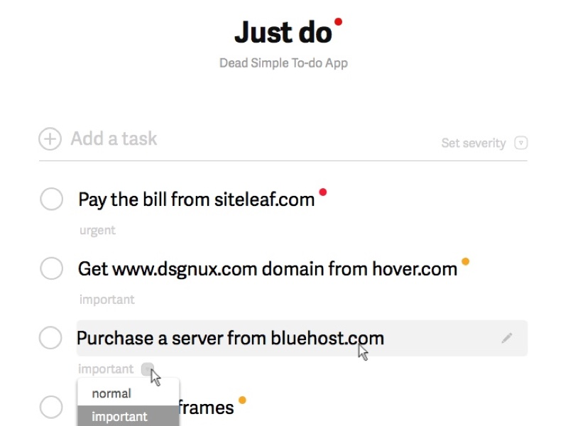

# Softexpert Case Study

> A ToDo List written for implement React with Redux data-flow.

[](https://travis-ci.org/renatobenks/ToDoListSoftExpert)

[](https://www.codacy.com/app/renato-benkendorf/ToDoListSoftExpert?utm_source=github.com&amp;utm_medium=referral&amp;utm_content=renatobenks/ToDoListSoftExpert&amp;utm_campaign=Badge_Grade)

[](https://codeclimate.com/repos/58bddd275723fd027b003f5a/coverage)

[](https://codeclimate.com/repos/58bddd275723fd027b003f5a/feed)
[](https://codeclimate.com/repos/58bddd275723fd027b003f5a/feed)

Esta é uma pequena aplicação de ToDo List, que deverá ser extendida e melhorada.

[Leia mais sobre esse app aqui](./.docs/about.md)



---

## Requirements

Para que esta aplicação possa ser funcionar, tenha certeza
que você tem instalado no seu ambiente o Node.js.
E que as seguintes ferramentas estão corretamente configuradas:

- Node.js (recommended: 4.x):
```bash
$ node --version
```

- npm (recommended: 2.x or 3.x)
```bash
$ npm --version
```

## Running app

Uma vez que você garantiu a instalação das ferramentas acima,
veja como colocar o app rodando:

Instale as depêndencias da aplicação:

```sh
$ npm i
```

### Environment: development

Para construir a aplicação em modo de desenvolvimento:


```sh
$ npm start
```

Assim que você tiver o bundle construído, você pode abrir o
`index.html`  no seu browser e verificar se a aplicação
está funcionando corretamente.

### Testing components

Como esta aplicação é para ser supostamente um case study e não
uma aplicação real, você pode habilitar testes específicos,
adicionado "#testName" na URL.

Por exemplo, para habilitar o teste "renderBottom", você abrirá
o arquivo `index.html` e adicionará no final a hash "#renderBottom".

Example URL:

    file:///C:/Users/user/Desktop/TodoList/index.html#renderBottom


Note que agora o campo input está renderizado abaixo da lista.

---
